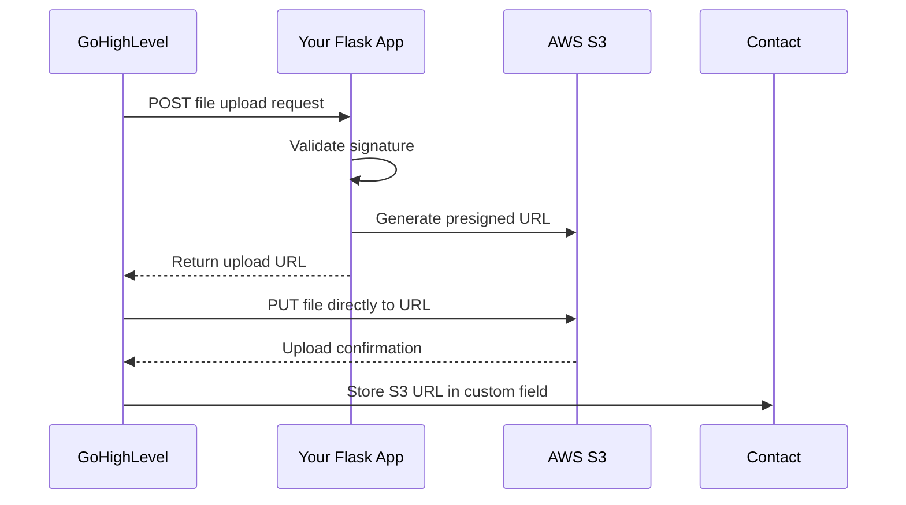

# S3 Bucket Setup

## GoHighLevel (GHL) CRM integrations with your S3 bucket securely, we need to implement a robust solution. I'll walk you through the best approach and provide complete implementation

### Solution Overview

1. **Create IAM Role for GHL Integration** (with strict permissions)
2. **Generate Pre-signed URLs** (temporary upload permissions)
3. **Set Up Bucket Notifications** (trigger actions on upload)
4. **Configure GHL Webhook Integration**

### Step 1: Create Dedicated IAM Policy for GHL

```python
def create_ghl_policy(bucket_name):
    iam = boto3.client('iam')
    
    policy_document = {
        "Version": "2012-10-17",
        "Statement": [
            {
                "Sid": "AllowGHLUploads",
                "Effect": "Allow",
                "Action": "s3:PutObject",
                "Resource": f"arn:aws:s3:::{bucket_name}/ghl-uploads/*"
            },
            {
                "Sid": "DenyAllExceptUploads",
                "Effect": "Deny",
                "NotAction": "s3:PutObject",
                "NotResource": f"arn:aws:s3:::{bucket_name}/ghl-uploads/*"
            }
        ]
    }
    
    try:
        response = iam.create_policy(
            PolicyName=f"{bucket_name}-GHL-Upload",
            PolicyDocument=json.dumps(policy_document),
            Description="Restricted upload access for GoHighLevel CRM"
        )
        return response['Policy']['Arn']
    except iam.exceptions.EntityAlreadyExistsException:
        return f"arn:aws:iam::{boto3.client('sts').get_caller_identity()['Account']}:policy/{bucket_name}-GHL-Upload"
```

### Step 2: Generate Pre-signed Upload URLs

```python
def generate_upload_url(bucket_name, file_name, content_type='application/pdf'):
    s3 = boto3.client('s3')
    
    try:
        url = s3.generate_presigned_url(
            ClientMethod='put_object',
            Params={
                'Bucket': bucket_name,
                'Key': f"ghl-uploads/{file_name}",
                'ContentType': content_type
            },
            ExpiresIn=3600  # 1-hour validity
        )
        return url
    except ClientError as e:
        print(f"URL generation error: {e}")
        return None

# Example usage
upload_url = generate_upload_url("your-bucket", "customer-contract.pdf")
print(f"GHL Upload URL: {upload_url}")
```

### Step 3: Configure S3 Bucket for GHL Uploads

```python
def configure_ghl_bucket(bucket_name):
    s3 = boto3.client('s3')
    
    # Create upload folder
    s3.put_object(Bucket=bucket_name, Key="ghl-uploads/")
    
    # Add bucket policy
    policy = {
        "Version": "2012-10-17",
        "Statement": [
            {
                "Sid": "AllowGHLUploads",
                "Effect": "Allow",
                "Principal": "*",
                "Action": "s3:PutObject",
                "Resource": f"arn:aws:s3:::{bucket_name}/ghl-uploads/*"
            }
        ]
    }
    
    s3.put_bucket_policy(Bucket=bucket_name, Policy=json.dumps(policy))
    
    print(f"Bucket configured for GHL uploads: s3://{bucket_name}/ghl-uploads/")
```

### Step 4: Set Up GHL Webhook Integration

GoHighLevel doesn't support direct S3 integration, so we'll use a webhook approach:

1. **Create API Endpoint in Your Flask App**:

```python
from flask import request, jsonify

@app.route('/ghl-webhook', methods=['POST'])
def ghl_webhook():
    data = request.json
    
    # Validate webhook origin
    if not valid_ghl_signature(request):
        return jsonify({"error": "Invalid signature"}), 403
    
    # Extract file details
    file_name = data.get('file_name')
    contact_id = data.get('contact_id')
    
    # Generate upload URL
    upload_url = generate_upload_url("your-bucket", file_name)
    
    return jsonify({
        "upload_url": upload_url,
        "method": "PUT",
        "headers": {"Content-Type": "application/pdf"}
    })

def valid_ghl_signature(request):
    # Implement signature validation
    # See: https://highlevel.stoplight.io/docs/integrations/ZG9jOjE1ODU0MTQz-webhook-signature
    return True  # Add actual validation logic
```

### Step 5: Configure GoHighLevel

1. In GHL, create a new webhook integration:
   - URL: `https://yourdomain.com/ghl-webhook`
   - Trigger: "When file is added to contact"
   - Payload format:

     ```json
     {
       "contact_id": "{{contact.id}}",
       "file_name": "{{file.name}}",
       "file_type": "{{file.type}}"
     }
     ```

2. Map the webhook response to a custom field:
   - Response parsing: `{{upload_url}}`
   - Store in contact field: "S3 Upload URL"

### Security Enhancements

1. **IP Whitelisting**:

   ```python
   # In bucket policy
   "Condition": {
       "IpAddress": {
           "aws:SourceIp": [
               "34.210.87.42",   # GHL US West
               "52.39.82.17"     # GHL US East
           ]
       }
   }
   ```

2. **Temporary Credentials**:

   ```python
   # Use STS for short-lived credentials
   sts = boto3.client('sts')
   credentials = sts.assume_role(
       RoleArn="arn:aws:iam::123456789012:role/GHL-Upload-Role",
       RoleSessionName="GHL-Upload",
       DurationSeconds=900  # 15-minute credentials
   ).get('Credentials')
   ```

3. **Upload Validation**:

   ```python
   # Add to Flask webhook
   s3 = boto3.client('s3')
   s3.put_public_access_block(
       Bucket=bucket_name,
       PublicAccessBlockConfiguration={
           'BlockPublicAcls': True,
           'IgnorePublicAcls': True,
           'BlockPublicPolicy': True,
           'RestrictPublicBuckets': True
       }
   )
   ```

### Complete Workflow



### Testing the Integration

1. **Test Webhook**:

```python
import requests

webhook_url = "https://yourdomain.com/ghl-webhook"
payload = {
    "contact_id": "12345",
    "file_name": "test-contract.pdf",
    "file_type": "application/pdf"
}

response = requests.post(webhook_url, json=payload)
print(response.json())
```

2. **Upload Test File**:

```python
upload_url = response.json()['upload_url']
with open('test.pdf', 'rb') as f:
    response = requests.put(upload_url, data=f, headers={'Content-Type': 'application/pdf'})
print(f"Upload status: {response.status_code}")
```

### Best Practices

1. **Monitor Uploads**:

   ```python
   # Enable S3 access logging
   s3.put_bucket_logging(
       Bucket=bucket_name,
       BucketLoggingStatus={
           'LoggingEnabled': {
               'TargetBucket': 'your-log-bucket',
               'TargetPrefix': 'ghl-uploads/'
           }
       }
   )
   ```

2. **Set Lifecycle Rules**:

   ```python
   # Auto-delete unfinished uploads
   s3.put_bucket_lifecycle_configuration(
       Bucket=bucket_name,
       LifecycleConfiguration={
           'Rules': [{
               'ID': 'AbortIncompleteUploads',
               'Status': 'Enabled',
               'Prefix': 'ghl-uploads/',
               'AbortIncompleteMultipartUpload': {'DaysAfterInitiation': 1}
           }]
       }
   )
   ```

3. **Scan Uploads** (optional):

   ```python
   # Trigger AWS Lambda on upload
   s3.put_bucket_notification_configuration(
       Bucket=bucket_name,
       NotificationConfiguration={
           'LambdaFunctionConfigurations': [{
               'LambdaFunctionArn': 'your-lambda-arn',
               'Events': ['s3:ObjectCreated:*'],
               'Filter': {'Key': {'FilterRules': [{'Name': 'prefix', 'Value': 'ghl-uploads/'}]}
           }}]
       }
   )
   ```

This solution provides:

- Secure, temporary upload URLs
- End-to-end integration with GoHighLevel
- Audit trails and monitoring
- Automatic cleanup of failed uploads
- Strict access controls
- File validation capabilities
